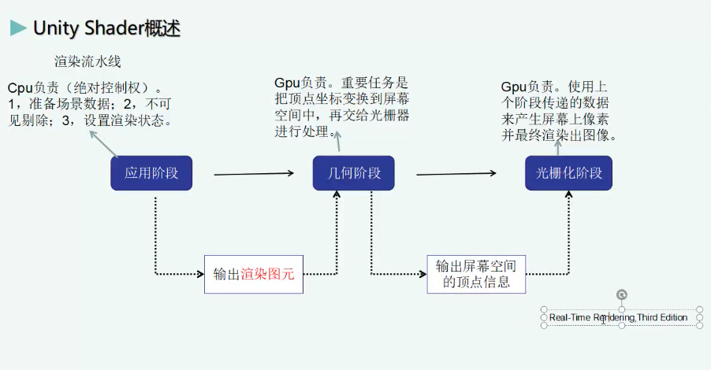
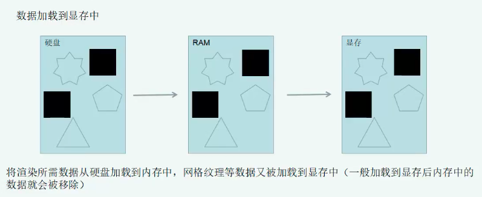
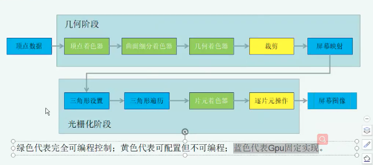
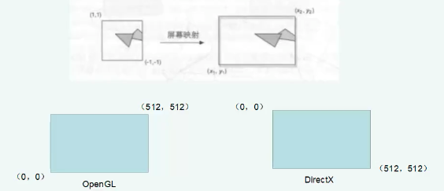

# Unity Shader入门

## 1. 渲染流水 - 过程

#### 1. 应用阶段

CPU 负责(绝对控制权)
* 1. 准备场景数据
* 2. 不可见剔除
* 3. 设置渲染状态
* 4. 输出 **渲染图元** 传递给几何阶段

#### 2. 几何极端

GPU 负责。
* 重要任务是把顶点坐标变换到屏幕空间中，在交给光栅器进行处理。
* 输出屏幕空间的顶点信息。

#### 3. 光栅化阶段

GPU 负责。
使用上个阶段传递的数据来产生屏幕上像素并最终渲染出图像。

</img>

## 2. CPU 应用阶段

#### 1. 把数据加载到显存中。【硬盘 -> RAM(内存) -> 显存】

</img>

#### 2. 设置渲染状态。

这些状态定义了场景中的网格是怎么被渲染的。例如，使用哪个顶点着色器，片原着色器，光源属性，材质等。

####  3. 调用 Draw Call。

Draw Call 就是一个命令，它的发起方是CPU，接收方是GPU。这个命令仅仅会指向一个需要被渲染的图元列表，而不会包含任何材质信息。

## 3. GPU 流水线

**几何阶段** 和 **光栅化阶段**，开发者无法拥有绝对的控制权，其实现的载体是GPU。GPU通过实现流水线化，大大加快了渲染速度。虽然我们无法完全控制这两个阶段的实现细节，但是GPU向开发者开放了很多控制权。

</img>

操作说明:

* 1. **顶点数据**为输入，顶点数据是由应用阶段加载到显存中，再由Draw Call指定的。这些数据随后被传递给顶点着色器。
* 2. **顶点着色器**是完全可编程的，它通常用于实现顶点的空间变换，顶点着色器等功能。
* 3. **曲面细分着色器**是一个可选着色器，用于细分图元。
* 4. **集合着色器**同样是可选着色器，可以被用于执行逐图元的着色操作，或者被产生用于更多的图元。
* 5. **裁剪**这一阶段的目的是将那些不在摄像机视野内的顶点裁剪掉，剔除某些三角图元的面片。这个阶段可配置。
* 6.**逐片元操作**阶段负责很多重要操作，比如改颜色，深度缓冲，进行混合等，不可变成，但是可配置。

#### 1. 顶点着色器

顶点着色器的处理单位是顶点，也就是说，输入进来的每个顶点都会调用一次顶点着色器。顶点着色器本身不可以创建或者销毁任何顶点，而且无法得到顶点与顶点直接的关系。GPU可以利用本身的特点快速处理每一个顶点。
顶点着色器主要完成的工作: **坐标变换**及**逐顶点光照**。当然，除此之外还可以输出后续阶段所需要的数据等。

#### 2. 裁剪

一个图元与摄像机的关系有3种:**完全在视野内**，**部分在视野内**，**完全在视野外**。
**完全在视野内**的图元就继续传递给下一个流水线阶段。
**完全在视野外**的图元不会继续向下传递。
**部分在视野内**的需要进行裁剪。

#### 3. 屏幕映射

**屏幕映射**的任务是将裁剪后的齐次坐标(NDC)转换到屏幕坐标系，屏幕坐标系是一个二维坐标系，和用于显示画面的分辨率有很大关系。
屏幕映射将齐次坐标下 -1, 1的坐标范围转换到(x1, y1)。可以看到这个过程实际上就是一个缩放的过程。在这个处理中z轴不做处理。屏幕坐标系和z轴构成了窗口坐标系。这些值会被传到光栅化阶段。
</img>

## 4. 光栅化

* 三角形设置
    
    这个阶段会计算光栅化一个三角形网格所需要的信息。上一个阶段输出的都是三角网格的顶点，即我们得到的是三角网格每条边的两个端点。如果要得到正规三角网格对像素的覆盖情况，就必须计算每条边上的像素坐标。为了能够计算边界像素的坐标信息，就需要得到三角形边界的表示方式。
    
* 三角形遍历
    
    三角形遍历阶段将会检查每个像素是否被一个三角网格所覆盖。如果被覆盖的情况下，就会产生一个片元。而这样一个找到那些元素被三角网格覆盖的过程就叫做三角形遍历，也被称作扫描变换。

    三角形遍历阶段会根据上一个阶段的计算结果来判断一个三角网络覆盖了哪些像素，并使用三角网格三个顶点的顶点信息对整个覆盖区域的像素进行差值。

