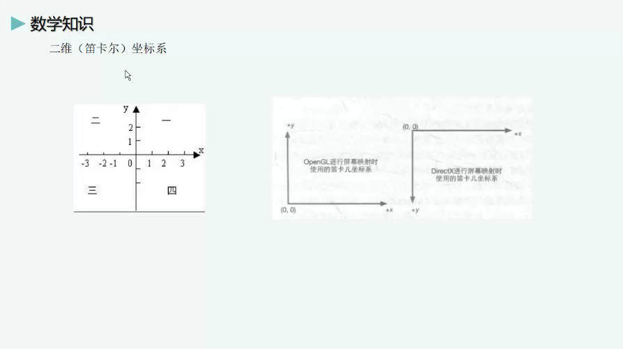
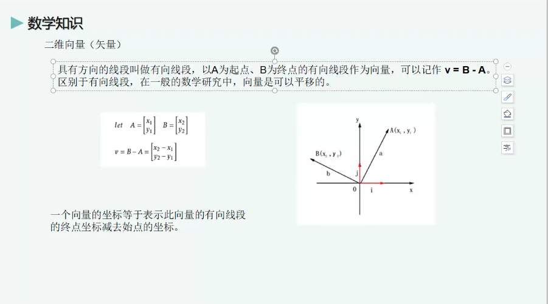
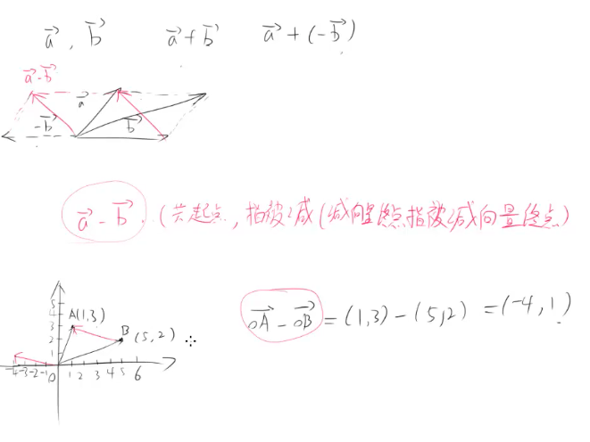
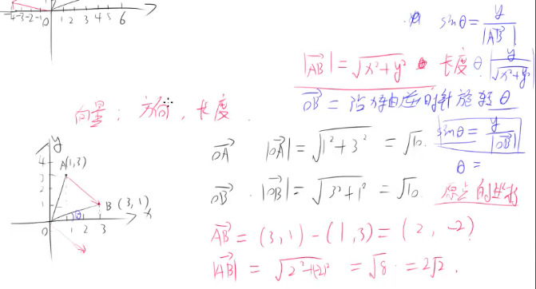
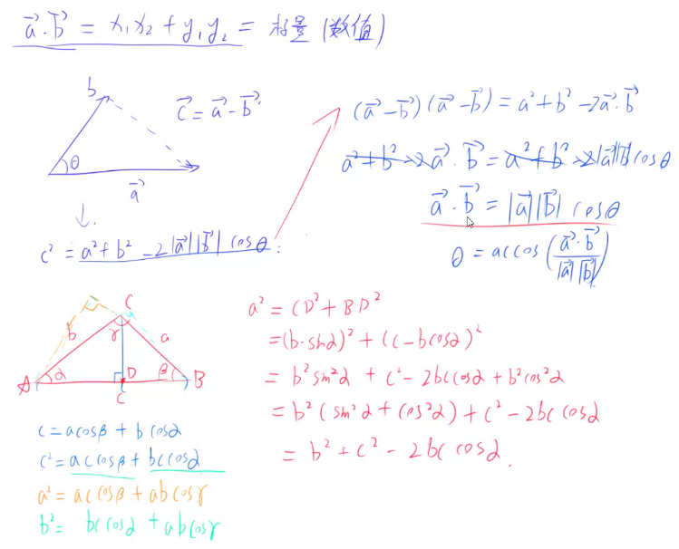

# Unity Shader入门

## 1、 二维

#### 1. 二维坐标
</img>

#### 2. 二维向量

具有方向的线段叫做有向线段，以A为起点、B为终点的有向线段作为向量，可以记作 v = B - A 区别于有向线段，在一般的数学中，向量是可以平移的。

向量代表（长度 和 方向）
</img>

#### 3. 二维向量加法

#### 4. 二维向量减法

A 向量 减  B 向量  =  A向量 加 负B向量

</img>

#### 5. 二维向量模

* 向量的模就是向量的长度，利用勾股定理计算向量的长度。
* 向量的长度，沿x轴逆时针旋转的角度。

</img>

#### 6. 二维向量点乘

点乘：V1(x1, y1) * V2(x2, y2) = V3(x1*x2, y1*y2) = 标量

</img>
 

83 * 5 = 400 

